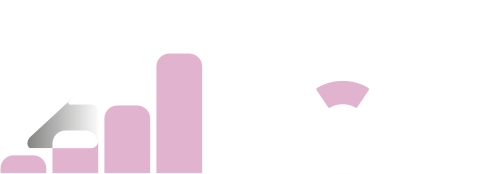

# HI, im Gabriel Cons

> **_Machines take me by surprise with great frequency._**  Alan Mathison Turing

## Programming tools i use

+ **Languages:** _C, C++, Python, Java, Bash, C#_
+ **Version control:** _Git_
+ **Editor:** _Neovim, Visual Studio Code, JetBrains IDEs._
+ **OS:** _GNU/Linux_ (currently daily driving OMARCHY)

  
  
  
  
  
   
  
  
  
  
  
   
  
  

## Certifications

<table border="0">
  <tr>
    <td align="center">
      
        
    <a href="https://www.credly.com/badges/858afafa-61ac-427d-9507-297653cbfc61"target="_blank">Verify</a>
    </td>
    <td align="center">
      
       
    <a href="https://www.credly.com/badges/637e849f-d910-4438-a0ae-f46c50a94bd5" target="_blank">Verify</a>
    </td>
  </tr>
</table>

## Achievements

<table border="0">
  <tr>
    <td>
      
    </td>
    <td>
      <strong>Datatón Sonora 2026 — First Place (Security Category)</strong> 
      <em>Granted by Agencia de Transformación Digital y Telecomunicaciones del Gobierno del Estado de Sonora.</em>
      
Designed and implemented an interactive Power BI dashboard focused on data-driven decision making.

    </td>
  </tr>
</table>

## Free Time Projects ;)

<table border:"0">
  <tr>
    <td align="center">
    
     
    <a href="https://el-conz.itch.io/" target="_blank">Visit my itch.io page</a>
  </td>    
    <td>
      
I build experimental projects, prototypes, and indie games in my free time. Click the card to explore my profile.

    </td>
  </tr>
</table>

<!-- FOR FUTURE use

IMAGES WITH LINKS
<a href="<link>" target="_blank">
    
  </a>

TABLES

| Columna 1 | Columna 2 | Columna 3 |
| --------- | --------- | --------- |
| Fila 1    | Dato 1    | Dato 2    |
| Fila 2    | Dato 3    | Dato 4    |

MARKDOWNS
- [ ] Tarea pendiente
- [x] Tarea completada

EMBED IMAGES

-->
